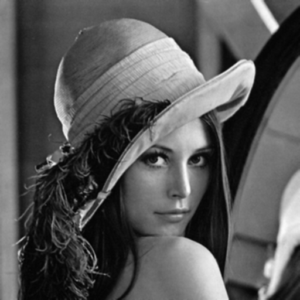

  - [How to Run the Application](#how-to-run-the-application)
  - [Project Overview](#project-overview)
  - [Key Features](#key-features)
  - [Components](#components)
    - [GUI Components](#gui-components)
    - [Computational Components](#computational-components)
  - [Implementation Details](#implementation-details)
    - [Image Handling](#image-handling)
      - [Input Loading](#input-loading)
      - [Output Showing](#output-showing)
    - [Sequential Implementation](#sequential-implementation)
      - [Kernel Creation:](#kernel-creation)
      - [Padding:](#padding)
      - [Applying the Filter:](#applying-the-filter)
    - [OpenMP Parallel Implementation](#openmp-parallel-implementation)
    - [MPI Parallel Implementation](#mpi-parallel-implementation)
      - [Running the MPI Program](#running-the-mpi-program)
      - [MPI Implementation](#mpi-implementation)
      - [Image Loading and Distribution](#image-loading-and-distribution)
      - [Kernel Size Broadcast](#kernel-size-broadcast)
      - [Data Distribution](#data-distribution)
      - [Padding and Filtering](#padding-and-filtering)
      - [Gather Filtered Data](#gather-filtered-data)
      - [MPI Output Display](#mpi-output-display)
  - [Input/Output Examples](#inputoutput-examples)
    - [1. 3x3 kernel](#1-3x3-kernel)
    - [2. 5x5 kernel](#2-5x5-kernel)
    - [3. 9x9 kernel](#3-9x9-kernel)
    - [4. 25x25 kernel](#4-25x25-kernel)
  - [Observations and Conclusion](#observations-and-conclusion)
  - [Graphs and Insights](#graphs-and-insights)
    - [Comparison between different image sizes](#comparison-between-different-image-sizes)
    - [Comparison between Image size effct](#comparison-between-image-size-effct)
    - [Comparison between number of threads(OpenMP, MPI)](#comparison-between-number-of-threadsopenmp-mpi)
  - [Extra High Pass filter](#extra-high-pass-filter)
    - [HPF Kernel 3x3](#hpf-kernel-3x3)
    - [HPF Kernel 5x5](#hpf-kernel-5x5)

<div class="page"/>


## How to Run the Application

In the `Executables` directory run `HPCProject.exe` and this window should open.
  
<div style="text-align: center;">


If this error was encountered try replacing the `libgomp-1.dll` in the `Executables` directory with one of the two provided dll versions.

<div style="text-align: center;">


<div class="page"/>

## Project Overview

This project is an application developed in C++ using the Qt framework. It offers a graphical user interface (GUI) for users to browse, process, and save images while applying a low-pass filter, also known as blurring. The application supports two different computational implementations:

1. **Sequential Implementation:** The low-pass filter is applied sequentially using a single thread.
2. **OpenMP Parallel Implementation:** The filter is parallelized using OpenMP to utilize multi-core processors.
3. **MPI Parallel Implementation:** The filter is parallelized using the Message Passing Interface (MPI) to distribute computation across multiple processes.

Users can dynamically specify various parameters, including image selection and filter kernel size. The application provides real-time feedback on processing time and kernel configuration.

The MPI parallel implementation is handled by another project using OpenCV, called from the main project in the background using a script.

Additionally, a parallel high-pass filter has been developed, featuring sequential, OpenMP, and MPI implementations.

## Key Features

- **Image Processing:** Users can load images of various formats (JPEG, PNG, BMP) and visualize them in the GUI.
- **Low-Pass Filtering:** Apply a low-pass filter to the loaded image, resulting in blurring effects. Users can choose between different computational implementations.
- **Dynamic Configuration:** Users can specify the kernel size for the filter, allowing customization of blurring intensity.
- **Parallel Processing:** The application supports shared-memory (OpenMP) parallelization, enabling efficient processing of large images.
- **Performance Monitoring:** Users can track the execution time of different filter implementations.

<div class="page"/>

## Components

### GUI Components

- **Image Display:** Visualizes the loaded image and the processed result after applying the filter.
- **File Browser:** Allows users to browse and select images from their filesystem, and saving the processed image.
- **Filter Controls:** Buttons for applying the low-pass filter, low-pass filter, and resetting the applied filter.
- **Output Label:** Displays information such as processing time and kernel size.

### Computational Components

- **Sequential Low Pass Filter:** Applies the low-pass filter to the image using a single thread.
- **OpenMP Low Pass Filter:** Parallelizes the filter computation using OpenMP directives for multi-threading by using `#pragma parallel for` to parallelize the for loops for padding and filter applying.
- **MPI Low Pass Filter:** Parallelizes the filter computation using MPI to distribute computation across multiple processes where the image is scattered and each process runs the filter on the local image part then gather the blurring result.

<div class="page"/>

## Implementation Details

### Image Handling

This is the only part where ready made functions are used for reading, creating, displaying, and saving the image. 

#### Input Loading

- Upon clicking the "Browse Image" button, a file dialog opens, allowing the user to select an image file of supported formats (JPEG, PNG, JPG, BMP).
- The selected image file path is stored in the `imagePath` variable to allow easier saving later on.
- If a valid image file path is provided (`imagePath` is not empty), the image is loaded using the Qt `QImage` class.
- The dimensions of the loaded image are determined (`Height,Width`), and the image is displayed in the GUI using a `QPixmap` set to the `imageLabel`.
- Memory is allocated for three separate arrays (`red`, `green`, and `blue`) to store the pixel values of the loaded image. Each array has a size equal to the product of the image height and width.
- Pixel values for each color channel (red, green, and blue) are extracted from the loaded image using the `qRed`, `qGreen`, and `qBlue` functions, respectively.
- The extracted pixel values are stored in their respective arrays (`red`, `green`, and `blue`).
- The `outputLabel` is set to be visible, indicating that the image has been successfully loaded.

For the MPI part:

- A script runs that utilizes `mpiexec` to distribute the image processing workload among multiple MPI processes.
- The selected image path is passed as an argument to the MPI program, which is responsible for reading and processing the image.
- In the MPI program, the image is loaded only in rank 0 using OpenCV.
- OpenCV is used to load the image (`imread`) and handle image processing tasks.
- The dimensions of the loaded image are determined (`Height,Width`),and the image vectors (`red`, `green`, and `blue`) are resized.
- Pixel values for each color channel (red, green, and blue) are extracted from the loaded image using OpenCV functions.
- These pixel values are stored in their respective vectors (`red`, `green`, and `blue`), facilitating subsequent image processing operations.

#### Output Showing

For the sequential-OpenMP implementation in Qt:

- After the low-pass filtering operation is performed, the filtered image is displayed in the GUI replacing the original image.
- The execution time of the sequential low-pass filter, along with the kernel size, is calculated and displayed in the GUI.

<div class="page"/>

For the MPI implementation using OpenCV:

- In the MPI program, rank 0 is responsible for reconstructing and displaying the filtered image.
- The filtered image is reconstructed using the pixel values stored in the `red`, `green`, and `blue` vectors.
- The filtered image is displayed in a new OpenCV window titled "Filtered Image".
- The execution time for the parallel low-pass filter using MPI is calculated and outputted to the console.


<div class="page"/>

### Sequential Implementation

The Sequential Implementation involves three main steps

#### Kernel Creation:

-  Create a 2D kernel array of size ``kxk` filled with ones, where k is the size of the filter which is provided by the user.

```c++
// Define the low-pass filter kernel
    // Create a kxk filter array filled with ones
    int **kernel = new int*[k];
    for (int i = 0; i < k; ++i) {
        kernel[i] = new int[k];
        for (int j = 0; j < k; ++j) {
            kernel[i][j] = 1;
        }
    }
```


#### Padding:

- Determine the amount of padding required based on the filter size `padding=k/2`.

- Create padded arrays for each color channel (red, green, blue) with additional space for padding. Increase both the Height and the Width by `2xpadding`.

- Iterate through each pixel of the original image. Copy original pixel values to the corresponding positions in the padded arrays.Replicate edge pixels horizontally and vertically to handle edge cases.

```c++
    // Calculate padding size
    int padding = k / 2;

    // Allocate memory for the padded arrays
    int *paddedRed = new int[(ImageWidth + 2 * padding) * (ImageHeight + 2 * padding)];
    int *paddedGreen = new int[(ImageWidth + 2 * padding) * (ImageHeight + 2 * padding)];
    int *paddedBlue = new int[(ImageWidth + 2 * padding) * (ImageHeight + 2 * padding)];


    // Copy the original image to the padded image with edge replication padding
    for (int y = 0; y < ImageHeight; y++) {
        for (int x = 0; x < ImageWidth; x++) {
            // Copy the original pixel value
            paddedRed[(y + padding) * (ImageWidth + 2 * padding) + (x + padding)] = red[y * ImageWidth + x];
            paddedGreen[(y + padding) * (ImageWidth + 2 * padding) + (x + padding)] = green[y * ImageWidth + x];
            paddedBlue[(y + padding) * (ImageWidth + 2 * padding) + (x + padding)] = blue[y * ImageWidth + x];

            // Replicate edge pixels horizontally
            if (x == 0) {
                for (int i = 1; i <= padding; i++) {
                    paddedRed[(y + padding) * (ImageWidth + 2 * padding) + (x + padding - i)] = red[y * ImageWidth + x];
                    paddedGreen[(y + padding) * (ImageWidth + 2 * padding) + (x + padding - i)] = green[y * ImageWidth + x];
                    paddedBlue[(y + padding) * (ImageWidth + 2 * padding) + (x + padding - i)] = blue[y * ImageWidth + x];
                }
            } else if (x == ImageWidth - 1) {
                for (int i = 1; i <= padding; i++) {
                    paddedRed[(y + padding) * (ImageWidth + 2 * padding) + (x + padding + i)] = red[y * ImageWidth + x];
                    paddedGreen[(y + padding) * (ImageWidth + 2 * padding) + (x + padding + i)] = green[y * ImageWidth + x];
                    paddedBlue[(y + padding) * (ImageWidth + 2 * padding) + (x + padding + i)] = blue[y * ImageWidth + x];
                }
            }

            // Replicate edge pixels vertically
            if (y == 0) {
                for (int i = 1; i <= padding; i++) {
                    paddedRed[(y + padding - i) * (ImageWidth + 2 * padding) + (x + padding)] = red[y * ImageWidth + x];
                    paddedGreen[(y + padding - i) * (ImageWidth + 2 * padding) + (x + padding)] = green[y * ImageWidth + x];
                    paddedBlue[(y + padding - i) * (ImageWidth + 2 * padding) + (x + padding)] = blue[y * ImageWidth + x];
                }
            } else if (y == ImageHeight - 1) {
                for (int i = 1; i <= padding; i++) {
                    paddedRed[(y + padding + i) * (ImageWidth + 2 * padding) + (x + padding)] = red[y * ImageWidth + x];
                    paddedGreen[(y + padding + i) * (ImageWidth + 2 * padding) + (x + padding)] = green[y * ImageWidth + x];
                    paddedBlue[(y + padding + i) * (ImageWidth + 2 * padding) + (x + padding)] = blue[y * ImageWidth + x];
                }
            }
        }
    }
```

<div class="page"/>

#### Applying the Filter:

- Iterate through each pixel of the padded image, excluding the padded border.
- Convolve the filter kernel with the corresponding pixels in the padded arrays to compute the filtered pixel values.
- Average the convolution results by dividing the sum by the total number of elements in the kernel.
- Set the filtered pixel value in the output image.

```c++
    // Apply the low-pass filter with  padding
    for (int y = padding; y < ImageHeight + padding; ++y) {
        for (int x = padding; x < ImageWidth + padding; ++x) {
            int redSum = 0, greenSum = 0, blueSum = 0;
            for (int ky = 0; ky < k; ++ky) {
                for (int kx = 0; kx < k; ++kx) {
                    redSum += kernel[ky][kx] * paddedRed[(y + ky - padding) * (ImageWidth + 2 * padding) + (x + kx - padding)];
                    greenSum += kernel[ky][kx] * paddedGreen[(y + ky - padding) * (ImageWidth + 2 * padding) + (x + kx - padding)];
                    blueSum += kernel[ky][kx] * paddedBlue[(y + ky - padding) * (ImageWidth + 2 * padding) + (x + kx - padding)];
                }
            }
            // Divide by the number of elements in the kernel for averaging
            redSum /= (k * k);
            greenSum /= (k * k);
            blueSum /= (k * k);

            QRgb color = qRgb(redSum, greenSum, blueSum);
            filteredImage.setPixel(x - padding, y - padding, color);
        }
    }
```
- note in the code the desired pixel is at index `[x+k/2][y+k/2]` which is equivelant to `[x-padding][y-padding]`.

<div class="page"/>

### OpenMP Parallel Implementation

It involves the same steps as the sequential implementation, however the for loops for padding and the for loops for kernel application utilizes openMP parallelization by using `#pragma omp parallel for num_threads(num_of_threads)` to execute it on multiple threads simultaneously

The application receives the number of threads as a user input.(the maximum number of cores in the system is calculated by the application to prevent a bad input).

```c++
// Copy the original image to the padded image with edge replication padding using parallel for
#pragma omp parallel for num_threads(num_of_threads)
        for (int y = 0; y < ImageHeight; y++) {
            for (int x = 0; x < ImageWidth; x++) {
                // Copy the original pixel value
                paddedRed[(y + padding) * (ImageWidth + 2 * padding) + (x + padding)] = red[y * ImageWidth + x];
                paddedGreen[(y + padding) * (ImageWidth + 2 * padding) + (x + padding)] = green[y * ImageWidth + x];
                paddedBlue[(y + padding) * (ImageWidth + 2 * padding) + (x + padding)] = blue[y * ImageWidth + x];

                // Replicate edge pixels horizontally
                if (x == 0) {
                    for (int i = 1; i <= padding; i++) {
                        paddedRed[(y + padding) * (ImageWidth + 2 * padding) + (x + padding - i)] = red[y * ImageWidth + x];
                        paddedGreen[(y + padding) * (ImageWidth + 2 * padding) + (x + padding - i)] = green[y * ImageWidth + x];
                        paddedBlue[(y + padding) * (ImageWidth + 2 * padding) + (x + padding - i)] = blue[y * ImageWidth + x];
                    }
                } else if (x == ImageWidth - 1) {
                    for (int i = 1; i <= padding; i++) {
                        paddedRed[(y + padding) * (ImageWidth + 2 * padding) + (x + padding + i)] = red[y * ImageWidth + x];
                        paddedGreen[(y + padding) * (ImageWidth + 2 * padding) + (x + padding + i)] = green[y * ImageWidth + x];
                        paddedBlue[(y + padding) * (ImageWidth + 2 * padding) + (x + padding + i)] = blue[y * ImageWidth + x];
                    }
                }

                // Replicate edge pixels vertically
                if (y == 0) {
                    for (int i = 1; i <= padding; i++) {
                        paddedRed[(y + padding - i) * (ImageWidth + 2 * padding) + (x + padding)] = red[y * ImageWidth + x];
                        paddedGreen[(y + padding - i) * (ImageWidth + 2 * padding) + (x + padding)] = green[y * ImageWidth + x];
                        paddedBlue[(y + padding - i) * (ImageWidth + 2 * padding) + (x + padding)] = blue[y * ImageWidth + x];
                    }
                } else if (y == ImageHeight - 1) {
                    for (int i = 1; i <= padding; i++) {
                        paddedRed[(y + padding + i) * (ImageWidth + 2 * padding) + (x + padding)] = red[y * ImageWidth + x];
                        paddedGreen[(y + padding + i) * (ImageWidth + 2 * padding) + (x + padding)] = green[y * ImageWidth + x];
                        paddedBlue[(y + padding + i) * (ImageWidth + 2 * padding) + (x + padding)] = blue[y * ImageWidth + x];
                    }
                }
            }
        }
```
```c++
// Apply the low-pass filter with padding in parallel using parralel for
#pragma omp parallel for num_threads(num_of_threads)
        for (int y = padding; y < ImageHeight + padding; ++y) {
            for (int x = padding; x < ImageWidth + padding; ++x) {
                int redSum = 0, greenSum = 0, blueSum = 0;
                for (int ky = 0; ky < k; ++ky) {
                    for (int kx = 0; kx < k; ++kx) {
                        redSum += kernel[ky][kx] * paddedRed[(y + ky - padding) * (ImageWidth + 2 * padding) + (x + kx - padding)];
                        greenSum += kernel[ky][kx] * paddedGreen[(y + ky - padding) * (ImageWidth + 2 * padding) + (x + kx - padding)];
                        blueSum += kernel[ky][kx] * paddedBlue[(y + ky - padding) * (ImageWidth + 2 * padding) + (x + kx - padding)];
                    }
                }
                // Divide by the number of elements in the kernel for averaging
                redSum /= (k * k);
                greenSum /= (k * k);
                blueSum /= (k * k);

                QRgb color = qRgb(redSum, greenSum, blueSum);
                filteredImage.setPixel(x - padding, y - padding, color);
            }
        }
```

<div class="page"/>

### MPI Parallel Implementation

#### Running the MPI Program
For the MPI parallel implementation, the main application handles the running of the mpi program by creating a script that calls the mpi executable using `mpiexec` and passing the number of processes and the path of the loaded image.

Note that it is a separate executable called mpi_lowpassfilter.exe and can be run from the terminal using `mpiexec -n {number of processes} {"path to the image"}.

- The dialog prompts the user to input the number of processes (`n`) to be used for MPI parallelization.
- A batch file (`run_mpi_low_pass_filter.bat`) is created to execute the MPI program.
- The selected image file path (`imagePath`) is converted to a standard string (`imagePathStr`) to pass it as an argument to the MPI program.
- The batch file is populated with the necessary commands to execute the MPI program (`mpi_lowpassfilter.exe`) with the specified number of processes (`n`) and the image file path (`imagePathStr`).
- The batch file is closed, and the system command is constructed to execute the batch file.
- Upon execution, the batch file runs the MPI program in parallel, distributing the image processing workload among the specified number of MPI processes.

#### MPI Implementation
It involves the same basic steps as the previous two implementation however it involves data distribution among processes.

#### Image Loading and Distribution

1. **Image Loading (Rank 0 only):**
   - Rank 0 reads the image from the specified path using OpenCV.
   - It extracts the image dimensions and pixel values for further processing.
  
```c++
  int k;
int ImageWidth, ImageHeight;
vector<int> red, green, blue;
// Load image in rank 0 only
Mat image_original;
if (world_rank == 0) {
    // Load the image using OpenCV
    image_original = imread(imagePath, IMREAD_COLOR);
    if (image_original.empty()) {
        cerr << "Error: Unable to load image " << imagePath << endl;
        MPI_Abort(MPI_COMM_WORLD, 1);
    }

    // Get image dimensions
    ImageWidth = image_original.cols;
    ImageHeight = image_original.rows;

    // Resize vectors
    red.resize(ImageHeight * ImageWidth);
    green.resize(ImageHeight * ImageWidth);
    blue.resize(ImageHeight * ImageWidth);

    // Fill vectors
    for (int y = 0; y < ImageHeight; y++) {
        for (int x = 0; x < ImageWidth; x++) {
            Vec3b pixel = image_original.at<Vec3b>(y, x);
            red[y * ImageWidth + x] = pixel[2]; // OpenCV uses BGR ordering
            green[y * ImageWidth + x] = pixel[1];
            blue[y * ImageWidth + x] = pixel[0];
        }
    }
}
```  

2. **Image Dimensions Broadcast:**
   - Rank 0 broadcasts the image dimensions (width and height) to all other processes using `MPI_Bcast`.

```c++
// Broadcast image dimensions from rank 0 to all other ranks
MPI_Bcast(&ImageWidth, 1, MPI_INT, 0, MPI_COMM_WORLD);
MPI_Bcast(&ImageHeight, 1, MPI_INT, 0, MPI_COMM_WORLD);
```

#### Kernel Size Broadcast
1. **Kernel Size Input (Rank 0 only):**
   - Rank 0 prompts the user to input the kernel size `k` for the low-pass filter.

2. **Kernel Size Broadcast:**
   - Rank 0 broadcasts the kernel size `k` to all other processes using `MPI_Bcast`.

```c++
// Broadcast kernel size from rank 0 to all other ranks
if (world_rank == 0) {
    cout << "Enter the kernel size K:" << endl;
    cin >> k;
}
MPI_Bcast(&k, 1, MPI_INT, 0, MPI_COMM_WORLD);
```
<div class="page"/>

#### Data Distribution
1. **Image Data Scatter:**
   - Rank 0 scatters the image pixel data (red, green, blue channels) among all processes using `MPI_Scatter`.
   - Each process receives a portion of the image data.
```c++
// Allocate memory for local image data
vector<int> local_Red(ImageWidth * ImageHeight / world_size);
vector<int> local_Green(ImageWidth * ImageHeight / world_size);
vector<int> local_Blue(ImageWidth * ImageHeight / world_size);


// Scatter image data to all processes
MPI_Scatter(red.data(), ImageWidth * ImageHeight / world_size, MPI_INT, local_Red.data(), ImageWidth * ImageHeight / world_size,
    MPI_INT, 0, MPI_COMM_WORLD);
MPI_Scatter(green.data(), ImageWidth * ImageHeight / world_size, MPI_INT, local_Green.data(), ImageWidth * ImageHeight / world_size,
    MPI_INT, 0, MPI_COMM_WORLD);
MPI_Scatter(blue.data(), ImageWidth * ImageHeight / world_size, MPI_INT, local_Blue.data(), ImageWidth * ImageHeight / world_size,
    MPI_INT, 0, MPI_COMM_WORLD);
```

#### Padding and Filtering
1. **Local Padding (Each Process):**
   - Each process pads its locally received portion of the image data to handle edge cases.
```c++
 // //make 2d dimension
 vector<vector<int>> local_padded_Red(ImageHeight / world_size + 2 * padding, vector<int>(ImageWidth + 2 * padding, 0));
 vector<vector<int>> local_padded_Green(ImageHeight / world_size + 2 * padding, vector<int>(ImageWidth + 2 * padding, 0));
 vector<vector<int>> local_padded_Blue(ImageHeight / world_size + 2 * padding, vector<int>(ImageWidth + 2 * padding, 0));
 
 // Pad the local image data by repeating edges
 for (int i = 0; i < ImageHeight / world_size; i++) {
     for (int j = 0; j < ImageWidth; j++) {
         // Copy original pixels
         local_padded_Red[i + padding][j + padding] = local_Red[i * ImageWidth + j];
         local_padded_Green[i + padding][j + padding] = local_Green[i * ImageWidth + j];
         local_padded_Blue[i + padding][j + padding] = local_Blue[i * ImageWidth + j];
     }
     // Repeat the left and right edges
     for (int j = 0; j < padding; j++) {
         local_padded_Red[i + padding][j] = local_Red[i * ImageWidth];
         local_padded_Green[i + padding][j] = local_Green[i * ImageWidth];
         local_padded_Blue[i + padding][j] = local_Blue[i * ImageWidth];
         local_padded_Red[i + padding][ImageWidth + padding + j] = local_Red[(i + 1) * ImageWidth - 1];
         local_padded_Green[i + padding][ImageWidth + padding + j] = local_Green[(i + 1) * ImageWidth - 1];
         local_padded_Blue[i + padding][ImageWidth + padding + j] = local_Blue[(i + 1) * ImageWidth - 1];
     }
 }
 // Repeat the top and bottom edges
 for (int i = 0; i < padding; i++) {
     for (int j = 0; j < ImageWidth + 2 * padding; j++) {
         local_padded_Red[i][j] = local_padded_Red[padding][j];
         local_padded_Green[i][j] = local_padded_Green[padding][j];
         local_padded_Blue[i][j] = local_padded_Blue[padding][j];
         local_padded_Red[ImageHeight / world_size + padding + i][j] = local_padded_Red[ImageHeight / world_size + padding - 1][j];
         local_padded_Green[ImageHeight / world_size + padding + i][j] = local_padded_Green[ImageHeight / world_size + padding - 1][j];
         local_padded_Blue[ImageHeight / world_size + padding + i][j] = local_padded_Blue[ImageHeight / world_size + padding - 1][j];
     }
 }
 ```

2. **Filtering (Each Process):**
   - Each process applies the low-pass filter to its local portion of the image data.
```c++

    // Apply the low-pass filter to local padded image data
    for (int y = padding; y < ImageHeight / world_size+padding; y++) {
        for (int x = padding; x < ImageWidth+padding; x++) {
            int redSum = 0, greenSum = 0, blueSum = 0;
            for (int ky = -padding; ky <= padding; ky++) {
                for (int kx = -padding; kx <= padding; kx++) {
                    redSum += kernel[ky + padding][kx + padding] * local_padded_Red[y + ky][x + kx];
                    greenSum += kernel[ky + padding][kx + padding] * local_padded_Green[y + ky][x + kx];
                    blueSum += kernel[ky + padding][kx + padding] * local_padded_Blue[y + ky][x + kx];
                }
            }
            // Divide by the number of elements in the kernel for averaging
            redSum /= (k * k);
            greenSum /= (k * k);
            blueSum /= (k * k);

            // Update local image data with filtered values
            int local_y = y - padding;
            int local_x = x - padding;
            local_Red[local_y * ImageWidth + local_x] = redSum;
            local_Green[local_y * ImageWidth + local_x] = greenSum;
            local_Blue[local_y * ImageWidth + local_x] = blueSum;
        }
    }
```
- note in the code the desired pixel is at index `[y+k/2][x+k/2]` which is equivelant to `[(y-padding)*width + x-padding*]` for flattened 2D array

#### Gather Filtered Data
1. **Filtered Data Gathering (Rank 0 only):**
   - Rank 0 gathers the filtered image data from all processes using `MPI_Gather`.
   - It collects filtered data from all processes to reconstruct the final filtered image.
```c++
// Gather filtered image data from all processes
MPI_Gather(local_Red.data(), ImageWidth * ImageHeight / world_size, MPI_INT, red.data(), ImageWidth * ImageHeight / world_size,
    MPI_INT, 0, MPI_COMM_WORLD);
MPI_Gather(local_Green.data(), ImageWidth * ImageHeight / world_size, MPI_INT, green.data(), ImageWidth * ImageHeight / world_size,
    MPI_INT, 0, MPI_COMM_WORLD);
MPI_Gather(local_Blue.data(), ImageWidth * ImageHeight / world_size, MPI_INT, blue.data(), ImageWidth * ImageHeight / world_size,
    MPI_INT, 0, MPI_COMM_WORLD);
```

#### MPI Output Display
1. **Execution Time Measurement (Rank 0 only):**
   - Rank 0 calculates the execution time of the parallel low-pass filter using MPI.

2. **Filtered Image Display (Rank 0 only):**
   - Rank 0 reconstructs the filtered image from the gathered data and displays it using OpenCV.

<div class="page"/>

## Input/Output Examples


<div class="page"/>


### 1. 3x3 kernel


<div class="page"/>

### 2. 5x5 kernel


<div class="page"/>

### 3. 9x9 kernel


<div class="page"/>

### 4. 25x25 kernel


<div class="page"/>


## Observations and Conclusion


1. As the kernel size increases the time increases (as expected)
2. As the image size increases the time increases (as expected)
3. As the number of threads/processes increases the time decreases (as expected)
4. In some anomaly cases - highlighted in red in the table – as the number of threads/processes increase the time increases. It is noticed that in MPI most of these anomaly cases occur when transitioning from 4 to 5 processes. 

**Conclusion - 1:** It is observed that in MPI when the number of processes are odd performance suffers. This behavior is also exhibited in OpenMP when the image size is small.

5. It is noticed that for small kernel sizes the difference in the timing between sequential, OpenMP, and MPI isn’t significant. However, for large kernel sizes a significant reduction in the execution time is recognized.

**Conclusion - 2:** For small kernel sizes there is no need to involve parallelization.

6. It is also noticed that OpenMP (shared-memory model) always surpasses MPI (message passing model) in the performance. This is due to the communication overhead that is present in MPI. So, one may prefer to use OpenMP for better timing results, on the expense of the overhead of memory access control and protection performed by the application developer.

<div class="page"/>

## Graphs and Insights

### Comparison between different image sizes

1. Small Image 64x64


2. Large Image 1024x1024


<div class="page"/>

### Comparison between Image size effct

1. Image size effect kernel 3x3


2. Image size effect kernel 55x55


<div class="page"/>

### Comparison between number of threads(OpenMP, MPI)
1. kernel size 3x3

2. kernel size 21x21

3. kernel size 55x55


<div class="page"/>

## Extra High Pass filter 

Same operations as the Low Pass Filter but with a different kernel and checking the pixel value range to be in [0,255].

```c++
 // Define the high-pass filter kernel
    int **kernel = new int*[k];
    for (int i = 0; i < k; ++i) {
        kernel[i] = new int[k];
        for (int j = 0; j < k; ++j) {
            kernel[i][j] = -1;
        }
    }
    kernel[k/2][k/2]=k*k-1;
```
```c++
 // Ensure the pixel value is within [0, 255]
            redSum = qBound(0, redSum, 255);
            greenSum = qBound(0, greenSum, 255);
            blueSum = qBound(0, blueSum, 255);
```
### HPF Kernel 3x3


<div class="page"/>


### HPF Kernel 5x5



